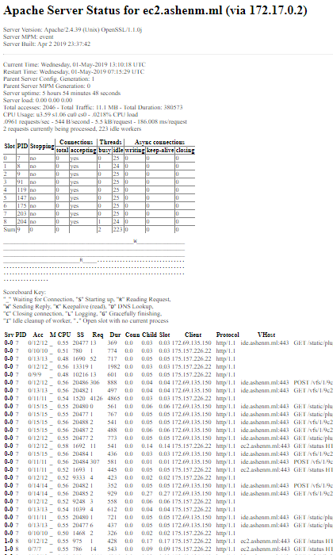
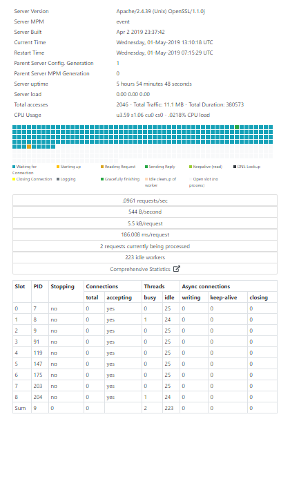

# BeautifyApacheStatus #
###### An Apache built-in Server Status Page Beautifier ######
[](https://travis-ci.org/ashenm/beautify-apache-status)

 

### USAGE ###

```apache
<Location /status>

  ...

  SetHandler server-status
  Substitute 's|</head>|<script src="https://ashenm.github.io/beautify-apache-status/beautify-apache-status.min.js" type="text/javascript"></script></head>|'

  ...

</Location>
```
